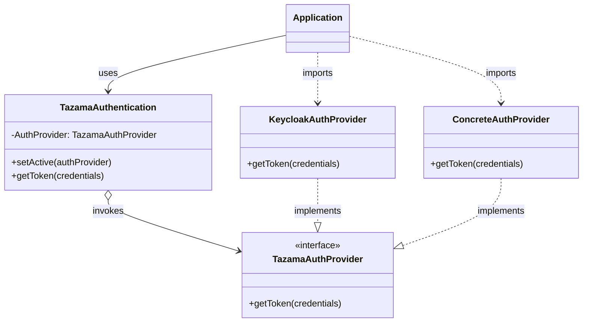

<!-- SPDX-License-Identifier: Apache-2.0 -->

# Auth-Lib

## Overview
Library used to get and validate tokens for Tazama. Requires an auth provider to be installed alongside.

## Installation

A personal access token is required to install this repository. For more information read the following.
https://docs.github.com/en/packages/learn-github-packages/about-permissions-for-github-packages#about-scopes-and-permissions-for-package-registries

Make sure you've got an .npmrc file in the root of your project, specifying where the @tazama-lf repo is. 
```
@tazama-lf:registry=https://npm.pkg.github.com
```

Thereafter you can run 
  > npm install @tazama-lf/auth-lib

Install an auth provider (The recommended provider to use is keycloak)
  > npm install @tazama-lf/auth-lib-provider-keycloak

## Usage

When Retrieving a token - Please note, the [Auth-Service](https://github.com/tazama-lf/auth-service) already does this. 

```typescript
// 1. Initialize the service and inject provider to use
import { TazamaAuthentication } from '@tazama-lf/auth-lib';

const exampleProvider = '@tazama-lf/auth-lib-provider-keycloak' // example provider
const authService: TazamaAuthentication = new TazamaAuthentication([exampleProvider]);

// 2. Initialize provider config and instantiate the provider
try {
  await authService.init();
} catch (error) {
  // handle error
}

// 3. Get Token
const token = await authService.getToken(username, password);
```

Validating the token received against roles provided.
```typescript
// 1. Validate Roles
import { validateTokenAndClaims } from '@tazama-lf/auth-lib';
const validated = validateTokenAndClaims(token, ["POST_V1_EVALUATE_ISO20022_PAIN_001_001_11"]);
```

##### Environment variables

| Variable | Purpose | Example
| ------ | ------ | ------ |
| `CERT_PATH_PRIVATE` | The pem file path for signing Tazama tokens | `/path/to/private-key.pem`
| `CERT_PATH_PUBLIC` | The pem file path for validating Tazama tokens | `/path/to/public-key.pem`

## Architecture



## Description

This TypeScript project involves authentication and token management using some auth provider (additional dependency) and JSON Web Tokens (JWT). The main components include interfaces, services, and utility functions to handle tokens.

### src/services/tazamaAuthentication.ts
This file contains the `TazamaAuthentication` class which is responsible for configuration and creation of instances of imported TazamaAuthProvider providers. It abstracts the creation logic and provides a unified interface for strategically retrieving authentication tokens.

[src/services/tazamaAuthentication.ts]()

### src/services/jwtService.ts
This file contains utility functions for signing and verifying JWT tokens using private and public PEM files. The main functions include:

 - `signToken`: Signs a TazamaToken using a private PEM file with the RS256 algorithm.
 - `verifyToken`: Verifies a signed JWT token using a public PEM file and returns the decoded payload if verification is successful.

[src/services/jwtService.ts]()

### src/services/tazamaService.ts
This file contains utility functions for validating tokens and their claims. The main function includes:

 - `validateTokenAndClaims`: Validates a given token and checks if it contains the required claims.

[src/services/tazamaService.ts]()

### src/interfaces/iTazamaToken.ts
This file defines the TazamaToken interface which outlines the structure of a token. It includes properties like `exp` (expiration time), `sid` (session ID), `iss` (issuer), `tokenString`, `clientId`, and `claims` (an array of strings representing the token's claims). It also defines the ClaimValidationResult type.

[src/interfaces/iTazamaToken.ts]()

### src/interfaces/iTazamaProvider.ts
This file defines the `iTazamaProvider` interface which outlines the contract for an TazamaAuthentication service. It specifies the `getToken` method and allows for generic parameters to hand control over to providers implementing the `TazamaAuthProvider` interface.

[src/interfaces/iTazamaProvider.ts]()

### src/index.ts
This file exports the main components of the library, including the `AuthenticationService` and `validateTokenAndClaims` function, as well as the `TazamaToken` type.

[src/interfaces/index.ts]()

## Creating Custom Providers

Creation of new custom providers to use with the Auth-lib will have to create a class that implements the `TazamaAuthProvider` interface. The contract allows the provider class to specify what arguments that the `getToken(...)` method can ingest.

For instance a getToken implementation with a three arguments (string, number, boolean) will require the custom provider to extend the class as follows.

```typescript
// Example 1
class CustomProvider implements TazamaAuthProvider<[string, number, boolean]> {
  // This gives getToken access to the following parameters
  async getToken(a: string, b: number, c: boolean): Promise<string> {
    // ...
  }
  // ...
}
```

```typescript
// Example 2
class CustomProvider implements TazamaAuthProvider<[string, string]> {
  // This gives getToken access to the following parameters
  async getToken(a: string, b: string): Promise<string> {
    // ...
  }
  // ...
}
```
